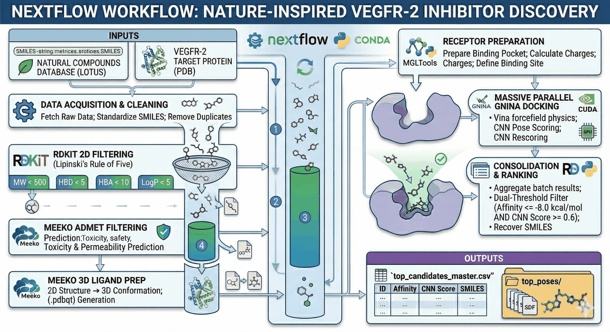

# Nature-Inspired VEGFR-2 Inhibitor Discovery Pipeline

This repository contains an automated computational pipeline built with Nextflow for the large-scale virtual screening of natural compounds against the human Vascular Endothelial Growth Factor Receptor 2 (**VEGFR-2**). The pipeline utilizes state-of-the-art physics-based docking engines combined with convolutional neural networks (CNN) scoring to identify high-affinity lead candidates for potential therapies in cancer and macular degeneration.

## Scientific Workflow

The pipeline automates the entire *in silico* screening process, divided into seven logical steps:

1. **`DOWNLOAD_AND_CLEAN_DATA`**: Fetches raw natural compound data (SMILES format) from a specified plant database and standardizes the input.
2. **`RDKIT_LIPINSKI_FILTER`**: Performs a preliminary druglikeness screening based on Lipinski's Rule of Five using the RDKit library.
3. **`MEEKO_ADMET_FILTER`**: Conducts a refined pharmacokinetic screening using Meeko for ADMET prediction, retaining only non-toxic, highly permeable candidates.
4. **`MEEKO_3D_LIGAND_PREP`**: Converts 2D SMILES of viable candidates into reliable 3D structural models (`.pdbqt`) ready for docking.
5. **`MGLTOOLS_RECEPTOR_PREP`**: Optimizes the VEGFR-2 target protein (PDB ID: 3V03) and identifies the crystallographic ligand binding site.
6. **`GNINA_LIGAND_DOCKING`**: Executes massive parallel docking using the GNINA engine. It combines Vina-based physics calculations with **CNN rescoring** (`--cnn_scoring rescore`) to assess binding poses with high confidence.
7. **`CONSOLIDATE_AND_RANK`**: The final critical step that aggregates results, applies an ultra-strict scientific filter (e.g., Vina Affinity <= -8.0 kcal/mol and CNN Score >= 0.6), recovers the original SMILES strings via RDKit, and outputs the top-ranking champions.

## Prerequisites

To run this pipeline, you need:

* **OS**: Linux or Windows Subsystem for Linux (WSL).
* **Java**: Required by Nextflow.
* **Nextflow**: Installable via curl.
* **Conda**: For automated environment management.
* **Hardware**: A CUDA-compatible NVIDIA GPU is highly recommended for efficient GNINA CNN scoring.

## Usage

### 1. Configure the pipeline (Optional)

You can define your input files and target protein in the `nextflow.config` file, or pass them as parameters:

    params.plant_data = "path/to/raw_smiles.txt"
    params.receptor_pdb = "path/to/veqfr2_target.pdb"

### 2. Run the pipeline

Execute the entire scientific workflow with automatic resume capability:

    nextflow run main.nf -resume

*The `-resume` flag ensures that if you modify a final step (e.g., making the filtering stricter), previous intensive calculations (like the ADMET filter or the actual docking) are reused from the cache.*

## Output Directory

The pipeline delivers a clean, ready-to-publish results directory:

    results/
    └── top_final/
        ├── top_candidates_master.csv   # Unified master table: IDs, Affinity, CNN Score, and Recovered SMILES
        └── top_poses/                  # Folder containing the 3D models (.sdf) of the top-ranking molecules

*Intermediate heavy files are kept in the work directory (`work/`) and not exported to `results/` to save disk space.*

## Phase 2: Visual Analysis & 3D Inspection (Jupyter Notebook)

Once the Nextflow pipeline completes the massive screening and generates the `top_candidates_master.csv`, the final selection is performed through interactive visual inspection to validate binding poses before proceeding to Molecular Dynamics (MD).

### Visualization Requirements
Ensure the following Python dependencies are installed in your local environment or Jupyter kernel:

### How to Visualize Top Candidates
1. Navigate to the project root directory.
2. Open your VS Code environment or launch Jupyter Notebook from the terminal.
3. Open the analysis notebook located at `notebooks/01_VGFR2_Top_Candidates_Visualization.ipynb`.
4. Execute the cells sequentially. The notebook will automatically:
   * **2D Grid:** Generate a vector-quality 2D grid with the chemical structures, IDs, and predicted affinities of the top ligands.
   * **3D Complex:** Construct a 3D interactive scene superimposing your best candidate (`.sdf`) directly into the binding pocket of the VEGFR-2 receptor (`3VO3.pdb`).

## Scientific Criteria & Key Software

* **Databases**: 
  * **LOTUS Database**: Primary data source for raw natural compound structures (SMILES).
  * **Protein Data Bank (PDB)**: Source for the VEGFR-2 crystallographic receptor.
* **Druglikeness & 2D Filtering**: **RDKit**. Applies Lipinski's Rule of Five to ensure baseline oral bioavailability.
* **Pharmacokinetics (ADMET)**: **Meeko / RDKit**. Filters candidates based on predicted safety, toxicity, and permeability profiles, discarding hazardous compounds early in the workflow.
* **3D Structure Generation & Preparation**: 
  * **Meeko**: Generates biologically relevant 3D conformations and converts viable ligands to `.pdbqt` format.
  * **MGLTools**: Prepares the target receptor (adds polar hydrogens, calculates Gasteiger charges, and extracts the co-crystallized control ligand).
* **Docking Engine & AI Scoring**: **GNINA (v1.0.3)**.
  * Combines the Vina empirical forcefield with Cross-Docking Convolutional Neural Networks (CNN) for pose evaluation.
  * Search thoroughness set to `--exhaustiveness 8`.
  * Dynamic binding site definition using the `--autobox_ligand` algorithm.
* **Data Consolidation & Traceability**: **RDKit & Python**. Recovers original SMILES strings from final 3D `.sdf` files and ranks top candidates based on a dual strict threshold (Affinity <= -8.0 kcal/mol & CNN score >= 0.6).
* **Visual Inspection (Phase 2)**: **py3Dmol & Pandas**. Used for programmatic 2D/3D evaluation of hit molecules and protein-ligand interactions within Jupyter Notebooks.

## References

* **GNINA (Docking Engine):** McNutt, A. T., Francoeur, P., Aggarwal, R., et al. (2021). GNINA 1.0: molecular docking with deep learning. *Journal of Cheminformatics*, 13(1), 43.
* **CNN Scoring Technology:** Ragoza, M., Hochuli, J., Idrobo, E., Sunseri, J., & Koes, D. R. (2017). Protein–Ligand Scoring with Convolutional Neural Networks. *Journal of Chemical Information and Modeling*, 57(4), 942-957.
* **Nextflow (Workflow Management):** Di Tommaso, P., Chatzou, M., Floden, E. W., et al. (2017). Nextflow enables reproducible computational workflows. *Nature Biotechnology*, 35(4), 316-319.
* **LOTUS Database:** Rutz, A., Sorokina, M., Galgonek, J., et al. (2022). The LOTUS initiative for open knowledge management in natural products research. *eLife*, 11, e70780.
* **RDKit (Cheminformatics):** RDKit: Open-source cheminformatics. https://www.rdkit.org
* **Meeko & AutoDock Vina Ecosystem:** Eberhardt, J., Santos-Martins, D., Tillack, A. F., & Forli, S. (2021). AutoDock Vina 1.2.0: New Docking Methods, Expanded Force Field, and Python Bindings. *Journal of Chemical Information and Modeling*, 61(8), 3891-3898.
* **MGLTools (Receptor Preparation):** Morris, G. M., Huey, R., Lindstrom, W., et al. (2009). AutoDock4 and AutoDockTools4: Automated docking with selective receptor flexibility. *Journal of Computational Chemistry*, 30(16), 2785-2791.

## License

This project is licensed under the MIT License - see the LICENSE file for details.